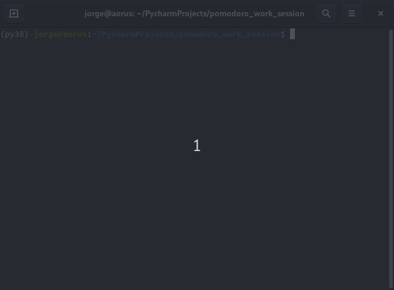

Pomodoro work session timer
===========================

> Status: First version released

This script is intended to be used as a Pomodoro alarm to divide a work session
into blocks. Between working blocks, there are breaks to relax or talk among 
the participants. At the end of each section it will produces a sound alarm
to notify that block has ended.

> Feel free to modify this code at your own will.

Motivation
----------

The confinement situation due to the COVID-19 pandemic has made it more difficult
for us as students to focus and advance in our studies, which is why, like
many others, we have created our own virtual office to work and support each
other online. This simple tool is useful for synchronizing blocks of work and fun.

Requirements
------------

The script requires __sox__ installed on your computer. In Ubuntu just type in a terminal

```
sudo apt install sox
```

Usage
------

Edit the number of blocks and duration directly into the python file.
Run the script, and press any key to start the session.




